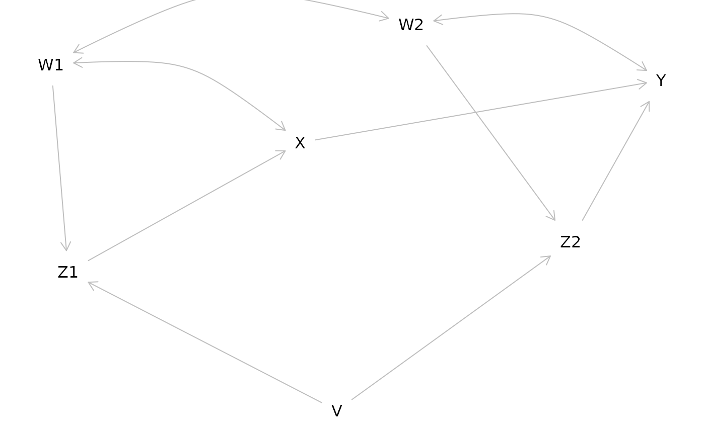

# A SEM user's guide to dagitty for R

## What is dagitty

Dagitty is a software to analyze causal diagrams, also known as directed
acyclic graphs (DAGs). Structural equation models (SEMs) can be viewed
as a parametric form of DAGs, which encode linear functions instead of
arbitrary nonlinear functions.

Because every SEM is a DAG, much of the methodology developed for DAGs
is of potentially great interest for SEM users as well. In this
vignette, I am going to show some possibilities. This follows the
structure of Kyono’s “Commentator” program
(<http://ftp.cs.ucla.edu/pub/stat_ser/r364.pdf>), and thereby also shows
how the tasks implemented in that program can be solved using the
dagitty package.

``` r

g1 <- dagitty( "dag {
    W1 -> Z1 -> X -> Y
    Z1 <- V -> Z2
    W2 -> Z2 -> Y
    X <-> W1 <-> W2 <-> Y
}")

g2 <- dagitty( "dag {
    Y <- X <- Z1 <- V -> Z2 -> Y
    Z1 <- W1 <-> W2 -> Z2
    X <- W1 -> Y
    X <- W2 -> Y
}")

plot(graphLayout(g1))
```



## List testable implications of a structural equation model

``` r

print( impliedConditionalIndependencies( g1 ) )
```

    V _||_ W1
    V _||_ W2
    V _||_ X | W1, Z1
    V _||_ Y | W1, W2, Z1, Z2
    W1 _||_ Z2 | W2
    W2 _||_ Z1 | W1
    X _||_ Z2 | V, W2
    X _||_ Z2 | W1, W2, Z1
    Z1 _||_ Z2 | V, W2
    Z1 _||_ Z2 | V, W1

## List adjustment sets for specific path coefficients

``` r

print( adjustmentSets( g1, "Z1", "X", effect="direct" ) )
```

    { W1 }

``` r

print( adjustmentSets( g2, "X", "Y", effect="direct" ) )
```

    { W1, W2, Z2 }
    { V, W1, W2 }
    { W1, W2, Z1 }

## List path coefficients that are identifiable by regression

``` r

for( n in names(g1) ){
    for( m in children(g1,n) ){
        a <- adjustmentSets( g1, n, m, effect="direct" )
        if( length(a) > 0 ){
            cat("The coefficient on ",n,"->",m,
                " is identifiable controlling for:\n",sep="")
            print( a, prefix=" * " )
        }
    }
}
```

    The coefficient on V->Z1 is identifiable controlling for:
    {}
    The coefficient on V->Z2 is identifiable controlling for:
    {}
    The coefficient on W1->Z1 is identifiable controlling for:
    {}
    The coefficient on W2->Z2 is identifiable controlling for:
    {}
    The coefficient on Z1->X is identifiable controlling for:
    { W1 }
    The coefficient on Z2->Y is identifiable controlling for:
    { W1, W2, Z1 }
    { V, W2 }

## List adjustment sets for specific total effects

``` r

print( adjustmentSets( g1, "X", "Y" ) )
```

``` r

print( adjustmentSets( g2, "X", "Y" ) )
```

    { W1, W2, Z2 }
    { V, W1, W2 }
    { W1, W2, Z1 }

## List total effects that are identifiable by regression

``` r

for( n in names(g1) ){
    for( m in setdiff( descendants( g1, n ), n ) ){
        a <- adjustmentSets( g1, n, m )
        if( length(a) > 0 ){
            cat("The total effect of ",n," on ",m,
                " is identifiable controlling for:\n",sep="")
            print( a, prefix=" * " )
        }
    }
}
```

    The total effect of V on Z2 is identifiable controlling for:
    {}
    The total effect of V on Y is identifiable controlling for:
    {}
    The total effect of V on Z1 is identifiable controlling for:
    {}
    The total effect of V on X is identifiable controlling for:
    {}
    The total effect of W1 on Z1 is identifiable controlling for:
    {}
    The total effect of W2 on Z2 is identifiable controlling for:
    {}
    The total effect of Z1 on X is identifiable controlling for:
    { W1 }
    The total effect of Z1 on Y is identifiable controlling for:
    { W1, W2, Z2 }
    { V, W1 }
    The total effect of Z2 on Y is identifiable controlling for:
    { W1, W2, Z1 }
    { V, W2 }

## List path coefficients that are identifiable through instrumental variables

``` r

for( n in names(g1) ){
    for( m in children(g1,n) ){
        iv <- instrumentalVariables( g1, n, m )
        if( length( iv ) > 0 ){
            cat( n, m, "\n" )
            print( iv , prefix=" * " )
        }
    }
}
```

    V Z1 
     *  Z2 |  W1
    V Z2 
     *  X |  W2
     *  Z1 |  W2
    W1 Z1 
     *  W2
     *  Z2 |  V
    W2 Z2 
     *  W1
     *  X |  V
     *  Z1 |  V
    X Y 
     *  V |  W2, Z2
     *  Z1 |  W1, W2, Z2
    Z1 X 
     *  V
     *  W2
     *  Z2
    Z2 Y 
     *  V |  X
     *  W1 |  X
     *  Z1 |  X
